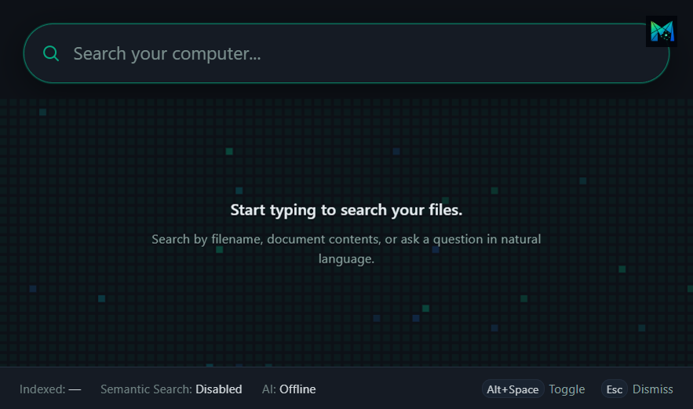
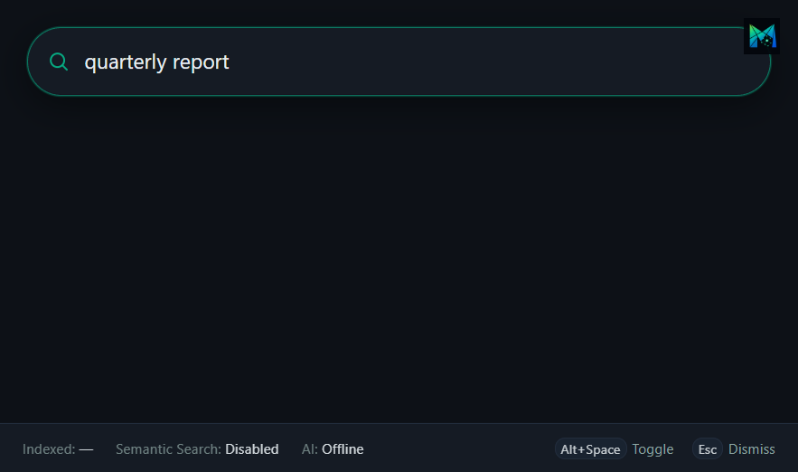

# AI Desktop Search

Local-first desktop search that finds your files by meaning and keyword.

**Display name / company / version** live in [`app.config.json`](./app.config.json) — change that file when renaming the product; packaging and the window title read from it.

## Screenshots

Launcher idle (mosaic brand) and searching (results slot reserved until the indexer lands):





Tray: left-click show/hide; right-click for Show, Start with Windows, and Quit. Escape dismisses and clears; Alt+Space toggles and keeps the query.

See [vision.md](./docs/vision.md) for the one-page product vision, [architecture.md](./docs/architecture.md) for the architecture design, [decisions.md](./docs/decisions.md) for the decisions I made and why, [ideas.md](./docs/ideas.md) for the future implementation ideas, [roadmap.md](./docs/roadmap.md) for the project roadmap, [tech-stack.md](./docs/tech-stack.md) for the tech stack used in this project, and [audit-2026-07-15.md](./docs/audit-2026-07-15.md) for the latest board/milestone audit.

## Layout

```
docs/        Project documentation
electron/    Electron shell (main, preload) — gatekeeper to FastAPI
frontend/    React + Material UI (Vite)
backend/     FastAPI app
data/        Local data (gitignored when real indexes land)
tools/       Dev utilities (corpus generator — output is outside the repo)
tests/       Tests
release/     Packaged builds (gitignored; from npm run package*)
```
## Prerequisites

- Python 3.x
- Node.js + npm

## First-time setup (once)

From the repo root in PowerShell:

```powershell
# Python env + FastAPI
python -m venv .venv
.\.venv\Scripts\Activate.ps1
pip install -r backend/requirements.txt

# Node deps (Electron, Vite, React, MUI, electron-builder)
npm install
```

## Spin up to test (every time)

One command from the repo root (after first-time setup):

```powershell
cd .
npm run dev
```

Electron probes `http://127.0.0.1:8000/health`. If a healthy FastAPI is already running, it **attaches** and leaves it alone on quit. Otherwise it **spawns** uvicorn from `.venv` (no `--reload`) and stops that child when you quit the app.

Endpoint framework (every API call follows this — React never hits FastAPI directly):

```
React → Electron (IPC) → FastAPI → Electron → React
```

### What to click

1. The launcher opens with a search field focused — type to begin (search logic comes later).
2. Top-right mark opens **System Status** (backend / Ollama check) for now; Settings later.
3. From anywhere, press **Alt+Space** to show/focus the app window (falls back to **Ctrl+Shift+Space** if Alt+Space is already taken). Remapping comes later via Settings.
4. Tray icon: left-click show/hide; right-click for Show, optional **Start with Windows**, and Quit. Startup is optional (#35) — best with a packaged build. Window size sticks for the session (Esc/Alt+Space); **Quit** resets to the default size next launch.
5. Quit Electron → if Electron spawned the backend, port 8000 should be free again.

### Optional: manual uvicorn (debug / hot reload)

```powershell
.\.venv\Scripts\Activate.ps1
cd backend
python -m uvicorn main:app --reload
```

Then `npm run dev` in another terminal — Electron attaches and will **not** kill your manual server on quit.

Odd layouts: set `AIDESKTOP_ROOT` to the repo root so Electron can find `.venv` and `backend/`.

Quick sanity check in a browser: http://127.0.0.1:8000/health — JSON with `status`, `version`, `timestamp`, and `capabilities`. API docs: http://127.0.0.1:8000/docs

### Other commands

| Command | What it does |
|---------|----------------|
| `npm run dev` | Vite + Electron (hot reload UI; Electron manages FastAPI) |
| `npm start` | Build React to `frontend/dist`, then open Electron (same backend lifecycle) |
| `npm run package` | Build React, then write an unpacked app under `release/win-unpacked/` |
| `npm run package:portable` | Same, plus a double-clickable Windows portable `.exe` in `release/` |
| `npm run icons` | Regenerate dark desktop/favicon icons from `docs/brand/app-mark-dark.png` |
| `npm run sync-config` | Sync `package.json` version/author from `app.config.json` |

Stop `npm run dev` with `Ctrl+C` in that terminal.

### Test corpus (local machine only)

For indexer/search work, generate a **control folder outside this repo** so tests mirror real opt-in roots and you don’t get false confidence from scanning the project tree (`node_modules`, source, docs, etc.). Scans skip hidden (dot-prefixed) names and a denylist that includes `node_modules` by default (`backend/indexer/ignore.py`; #45/#46).

```powershell
python tools/corpus/generate.py
```

Writes to `%USERPROFILE%\Documents\MosAIq-TestCorpus` by default (not committed to GitHub). Use `--clean` to wipe and recreate; `--out` to choose another path. Details: [`tools/corpus/README.md`](./tools/corpus/README.md). When folder pickers land, add **only** that Documents folder as a root — not the AIDesktopSearch project folder.

### Packaged app

After `npm run package:portable`, launch the exe named from `app.config.json`, e.g.:

- `release\<name> <version>.exe`, or
- `release\win-unpacked\<name>.exe`

Packaged builds do **not** bundle Python (#111). If a repo `.venv` is visible (or `AIDESKTOP_ROOT` points at one), Electron can spawn FastAPI; otherwise it attaches to an already-running server or System Status stays offline.

## How Electron talks to FastAPI

```
React (Check System Status)
  → preload.js (IPC: window.api.checkHealth)
  → electron/main.js (net.fetch)
  → http://127.0.0.1:8000/health
  → IPC result back to React
```

- `electron/main.js` — Electron main process; window + lifecycle hooks
- `electron/backendProcess.js` — attach / spawn / stop FastAPI
- `electron/preload.js` — safe bridge (`window.api.checkHealth`)
- `frontend/` — React + Material UI System Status screen
- `electron-builder.yml` — packaging config
