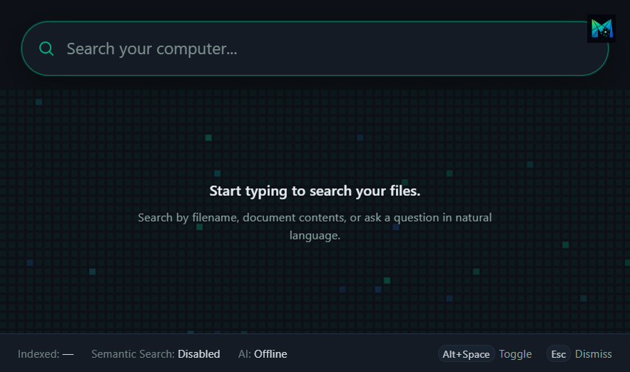
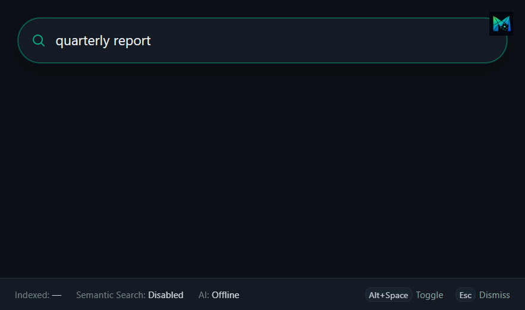

# AI Desktop Search

Local-first desktop search that finds your files by meaning and keyword.

**Display name / company / version** live in [`app.config.json`](./app.config.json) — change that file when renaming the product; packaging and the window title read from it.

## Screenshots





Tray: left-click show/hide; right-click for Show, Start with Windows, and Quit. Escape dismisses and clears; Alt+Space toggles and keeps the query.

## Quick start

**Prerequisites:** Python 3.x, Node.js + npm. **Ollama is optional** (classic filename/content search works without it).

### First-time setup (once)

From the **repo root** (wherever you cloned it):

```powershell
python -m venv .venv
.\.venv\Scripts\Activate.ps1
pip install -r backend/requirements.txt
npm install
```

### Run (every time)

```powershell
npm run dev
```

Electron probes `http://127.0.0.1:8000/health`. If a healthy FastAPI is already running, it **attaches** and leaves it alone on quit. Otherwise it **spawns** uvicorn from `.venv` (no `--reload`) and stops that child when you quit the app.

Every UI → API call goes through Electron (React never talks to FastAPI directly):

```
React → Electron (IPC) → FastAPI → Electron → React
```

### What to click

1. Launcher opens with the search field focused — type a filename substring (classic search; no Ollama required).
2. Top-right mark opens **System Status** — add / rescan / remove opt-in folder roots, plus backend / Ollama health.
3. **Alt+Space** show/focus (falls back to **Ctrl+Shift+Space** if Alt+Space is taken). Remapping later via Settings.
4. Tray: left-click show/hide; right-click Show, optional **Start with Windows**, Quit. Window size sticks for the session; **Quit** resets to the default size next launch.
5. Quit Electron → if Electron spawned the backend, port 8000 should be free again.

### Optional: manual uvicorn (debug / hot reload)

```powershell
.\.venv\Scripts\Activate.ps1
cd backend
python -m uvicorn main:app --reload
```

Then `npm run dev` in another terminal — Electron attaches and will **not** kill your manual server on quit.

Odd layouts: set `AIDESKTOP_ROOT` to the repo root so Electron can find `.venv` and `backend/`.

Sanity check: http://127.0.0.1:8000/health — JSON with `status`, `version`, `timestamp`, and `capabilities`. API docs: http://127.0.0.1:8000/docs

### Optional: Ollama (local models / embeddings)

Ollama is a **separate** Windows app — not installed into this repo, and never parented under Electron. Detection already lives in `GET /health` + System Status (#95). Install it on the machine so Phase 7 embedding work (#66+) and later RAG (#70) have a local runner.

**Install (pick one; run from any folder — not the repo):**

```powershell
# Official installer script
irm https://ollama.com/install.ps1 | iex

# Or winget
winget install --id Ollama.Ollama -e
```

Or download from [ollama.com/download/windows](https://ollama.com/download/windows).

**Verify the server** (PowerShell’s `curl` is not real curl — use `curl.exe`):

```powershell
ollama --version
curl.exe http://127.0.0.1:11434/api/version
```

Expect JSON with a `version`. If connection fails, start **Ollama** from the Start menu / tray and retry.

**In the app:** System Status → **Ollama: Available** (with version). Footer **Semantic Search** / **AI** stay off until generate/search (#66 / #68) and chat wiring (#70) land — that is expected.

**Vector store (#67):** after `pip install -r backend/requirements.txt`, System Status → **Check System Status** should show **Vector store: Available (sqlite-vec …)**. With at least one indexed folder/file, **Verify vector store** runs a throwaway k-NN round-trip (no rows left behind). Classic search still works if the extension fails to load.

**Optional embed model** (for #66; exact default may change):

```powershell
ollama pull nomic-embed-text
```

Bare `ollama` may open an interactive menu — Esc out; MosAIq only needs the background server on `127.0.0.1:11434`.

### Other commands

| Command | What it does |
|---------|----------------|
| `npm run dev` | Vite + Electron (hot reload UI; Electron manages FastAPI) |
| `npm start` | Build React to `frontend/dist`, then open Electron (same backend lifecycle) |
| `npm run package` | Build React, then write an unpacked app under `release/win-unpacked/` |
| `npm run package:portable` | Same, plus a double-clickable Windows portable `.exe` in `release/` |
| `npm run icons` | Regenerate dark desktop/favicon icons from `docs/brand/app-mark-dark.png` |
| `npm run sync-config` | Sync `package.json` version/author from `app.config.json` |

Stop `npm run dev` with `Ctrl+C` in that terminal.

## Test corpus (local machine only)

For indexer/search work, generate a **control folder outside this repo** so tests mirror real opt-in roots (do not index the project tree).

```powershell
python tools/corpus/generate.py
```

Writes to `%USERPROFILE%\Documents\MosAIq-TestCorpus` by default (**not** committed). Use `--clean` to wipe and recreate; `--out` for another path. Details: [`tools/corpus/README.md`](./tools/corpus/README.md). In System Status, add **only** that folder as a root — not the AIDesktopSearch repo.

## Packaged app

After `npm run package:portable`, launch the exe named from `app.config.json`, e.g.:

- `release\<name> <version>.exe`, or
- `release\win-unpacked\<name>.exe`

Packaged builds do **not** bundle Python (#111). If a repo `.venv` is visible (or `AIDESKTOP_ROOT` points at one), Electron can spawn FastAPI; otherwise it attaches to an already-running server or System Status stays offline.

## Layout

```
docs/        Project documentation
electron/    Electron shell (main, preload) — gatekeeper to FastAPI
frontend/    React + Material UI (Vite)
backend/     FastAPI app (+ indexer, search routing)
data/        Local SQLite index (gitignored — never commit)
tools/       Dev utilities (corpus generator — output is outside the repo)
tests/       Tests
release/     Packaged builds (gitignored)
```

## Docs

| Doc | What it is |
|-----|------------|
| [vision.md](./docs/vision.md) | One-page product vision |
| [architecture.md](./docs/architecture.md) | Process model + design |
| [schema.md](./docs/schema.md) | SQLite index schema |
| [decisions.md](./docs/decisions.md) | Locked choices and why |
| [roadmap.md](./docs/roadmap.md) | Milestones |
| [tech-stack.md](./docs/tech-stack.md) | Stack notes |
| [ideas.md](./docs/ideas.md) | Post-MVP ideas |
| [audit-2026-07-15.md](./docs/audit-2026-07-15.md) | Board / milestone audit |

## How Electron talks to FastAPI

```
React (e.g. System Status / search)
  → preload.js (IPC: window.api.*)
  → electron/main.js (net.fetch)
  → http://127.0.0.1:8000/...
  → IPC result back to React
```

- `electron/main.js` — window + lifecycle
- `electron/backendProcess.js` — attach / spawn / stop FastAPI
- `electron/preload.js` — safe bridge (`window.api`)
- `frontend/` — launcher + System Status
- `electron-builder.yml` — packaging config
